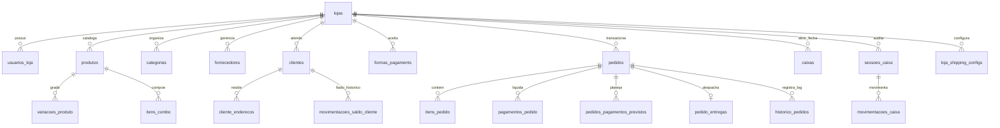
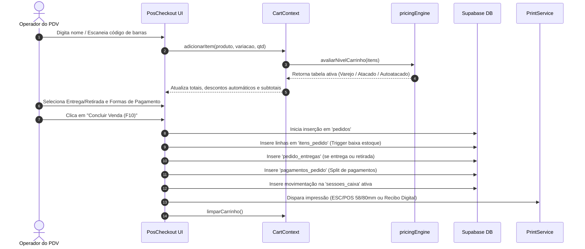

# 📘 DOCUMENTAÇÃO TÉCNICA E ARQUITETURAL DO SISTEMA HUBI

> **Versão do Documento:** 1.0.0  
> **Data de Atualização:** 16/09/2026  
> **Classificação:** Documento Técnico de Arquitetura, Engenharia e Operações  
> **Público-alvo:** Desenvolvedores, Engenheiros de Software, Arquitetos e Agentes de IA

---

## 📑 SUMÁRIO
1. [Visão Geral do Sistema e Stack Tecnológica](#1-visão-geral-do-sistema-e-stack-tecnológica)
   - [1.1 Propósito e Objetivos do Produto](#11-propósito-e-objetivos-do-produto)
   - [1.2 Módulos Principais](#12-módulos-principais)
   - [1.3 Stack do Front-end](#13-stack-do-front-end)
   - [1.4 Stack do Back-end, BaaS e Infraestrutura](#14-stack-do-back-end-baas-e-infraestrutura)
2. [Arquitetura e Diretrizes Estabelecidas (Skills & Google Mantis)](#2-arquitetura-e-diretrizes-estabelecidas-skills--google-mantis)
   - [2.1 Prontidão e Framework de Segurança Google Mantis](#21-prontidão-e-framework-de-segurança-google-mantis)
   - [2.2 Padrões de Escrita de Código e Modularidade](#22-padrões-de-escrita-de-código-e-modularidade)
   - [2.3 Políticas Rígidas de Banco de Dados: Proibição de Metadados JSONB Genéricos](#23-políticas-rígidas-de-banco-de-dados-proibição-de-metadados-jsonb-genéricos)
   - [2.4 Padrões de Nomenclatura e Localização (pt-BR)](#24-padrões-de-nomenclatura-e-localização-pt-br)
3. [Modelagem Atual do Banco de Dados (Supabase / PostgreSQL)](#3-modelagem-atual-do-banco-de-dados-supabase--postgresql)
   - [3.1 Visão Relacional Geral](#31-visão-relacional-geral)
   - [3.2 Dicionário Completo de Dados das Tabelas Críticas](#32-dicionário-completo-de-dados-das-tabelas-críticas)
   - [3.3 Triggers, Automações e Segurança no Banco (RLS)](#33-triggers-automações-e-segurança-no-banco-rls)
4. [Módulos e Fluxos Operacionais Existentes](#4-módulos-e-fluxos-operacionais-existentes)
   - [4.1 Fluxo do PDV (Frente de Caixa e Fechamento)](#41-fluxo-do-pdv-frente-de-caixa-e-fechamento)
   - [4.2 Fluxo de Edição de Pedidos Pendentes](#42-fluxo-de-edição-de-pedidos-pendentes)
   - [4.3 Fluxo do Catálogo Online Integrado](#43-fluxo-do-catálogo-online-integrado)
   - [4.4 Sistema de Autenticação e Isolamento Multi-tenant](#44-sistema-de-autenticação-e-isolamento-multi-tenant)
5. [Serviços e Utilitários Globais](#5-serviços-e-utilitários-globais)
   - [5.1 Supabase Client e Camada de Acesso a Dados](#51-supabase-client-e-camada-de-acesso-a-dados)
   - [5.2 Orquestrador e Serviços de Logística (Uber Direct e Melhor Envio)](#52-orquestrador-e-serviços-de-logística-uber-direct-e-melhor-envio)
   - [5.3 Motor de Impressão Híbrido (ESC/POS Bluetooth, A4 PDF e Recibo Digital)](#53-motor-de-impressão-híbrido-escpos-bluetooth-a4-pdf-e-recibo-digital)
   - [5.4 Motor de Precificação Dinâmica (Pricing Engine)](#54-motor-de-precificação-dinâmica-pricing-engine)
   - [5.5 Gestão Transacional de Sessões de Caixa](#55-gestão-transacional-de-sessões-de-caixa)
   - [5.6 Componentes Globais e Formatação Centralizada](#56-componentes-globais-e-formatação-centralizada)

---

## 1. VISÃO GERAL DO SISTEMA E STACK TECNOLÓGICA

### 1.1 Propósito e Objetivos do Produto
O **HUBI** é uma solução completa de Enterprise Resource Planning (ERP), Ponto de Venda (PDV) e E-commerce Omnichannel, desenhada especificamente para pequenos e médios varejistas, atacadistas e prestadores de serviços autônomos. A plataforma opera como uma aplicação web progressiva (PWA) de alta velocidade, capaz de funcionar com fluidez em desktop, tablets e smartphones, com suporte a operação híbrida (online e tolerância à desconexão offline temporária).

### 1.2 Módulos Principais
1. **PDV Multiplataforma (Frente de Caixa):**
   - Venda ágil com leitura ótica de código de barras (câmera ou scanner laser USB/Bluetooth).
   - Busca preditiva por nome, SKU, variação ou categoria.
   - Aplicação dinâmica de tabelas de preço com base no volume adicionado ao carrinho.
   - Múltiplas formas de pagamento em uma única venda (Split de pagamento: Dinheiro, PIX, Cartão Débito/Crédito, Fiado com limite de crédito).
2. **Catálogo Online Integrado (Vitrine Virtual PWA):**
   - Vitrine pública para o cliente final acessível por URL amigável (`/catalog/:slug`).
   - Cotação instantânea de frete via integrações com Uber Direct e Melhor Envio (Jadlog, Correios, etc.) ou opção de Retirada na Loja.
   - Finalização com pedido direto no WhatsApp do lojista e geração de PIX dinâmico (Mercado Pago / Asaas).
3. **Gestão de Pedidos e Andamento em Tempo Real:**
   - Kanban e tabela operacional de pedidos com atualização via Supabase Realtime.
   - Edição bidirecional completa de pedidos pendentes com recálculo automático de estoque e financeiro.
   - Rastreamento público do status do pedido para o cliente final (`/order-tracking/:id`).
4. **Catálogo de Produtos, Variações e Grade de Estoque:**
   - Controle de produtos simples, kits/combos e produtos com grade de até 2 eixos de variação (ex: Cor x Tamanho).
   - Códigos de barras e estoques individuais por variação.
   - Tabelas de preço progressivas por volume: Varejo, Atacado, Autoatacado e Preço Promocional temporário.
5. **Gestão de Clientes e Controle de Fiado (Crediário Próprio):**
   - Cadastro completo de clientes com histórico de compras e múltiplos endereços.
   - Controle de limite de crédito, saldo devedor e quitações parciais de fiado com abatimento de saldo e comprovantes digitais.
6. **Finanças, Sessões de Caixa e DRE de Lucro Real:**
   - Controle rigoroso de sessões de caixa (abertura com fundo de troco, suprimentos, sangrias, conferência cega e fechamento com apuração de quebra/sobra).
   - Contas a pagar e a receber com suporte a despesas fixas recorrentes e alerta preventivo de vencimento.
   - Apuração do Lucro Líquido Real deduzindo CMV (Custo das Mercadorias Vendidas) e taxas contratuais de maquininhas de cartão.
7. **Assistente Inteligente Rubi IA & Chat:**
   - Inteligência Artificial conversacional conectada aos dados da loja para insights analíticos, giro de estoque, identificação de produtos parados e sugestões comerciais.

### 1.3 Stack do Front-end
- **Linguagem:** TypeScript 5.7+ em modo estrito (`strict: true`).
- **Framework Principal:** React 18.3+ (Hooks, Context API, Memoização).
- **Bundler & Build Tool:** Vite 6.1+ com configurações otimizadas para PWA (`vite-plugin-pwa`).
- **Roteamento:** React Router DOM 6.29+ com controle de rotas protegidas por RBAC.
- **Estilização e Design System:** TailwindCSS 3.4+ com tema escuro nativo (*Dark Slate* com destaques em *Emerald* `#10B981`), utilitários de contraste e animações fluidas.
- **Biblioteca de Ícones:** Lucide React (0.475+).
- **Manipulação de Datas:** `date-fns` (4.1+) com localização para `pt-BR`.
- **Geração de Documentos:** `jspdf` (2.5+) para geração client-side de orçamentos e recibos A4.
- **Leitura e Exportação de Planilhas:** `xlsx` (SheetJS 0.18+) para importação/exportação de catálogo, clientes e pedidos.
- **Renderização de QR Codes:** `qrcode.react` para pagamento instantâneo PIX na tela.
- **Áudio do Sistema:** Web Audio API nativa para sinfonias de bipe, feedback de checkout e alertas sonoros de novos pedidos.
- **Comunicação de Hardware:** Web Bluetooth API para impressão térmica direta sem drivers intermediários em impressoras ESC/POS (58mm e 80mm).

### 1.4 Stack do Back-end, BaaS e Infraestrutura
- **Backend as a Service (BaaS):** Supabase Cloud / Self-Hosted.
- **Banco de Dados Relacional:** PostgreSQL 15 com extensões `uuid-ossp` e `pgcrypto`.
- **Segurança de Acesso:** Row Level Security (RLS) mandatória em todas as tabelas públicas com isolamento por `loja_id` e verificação de `auth.uid()`.
- **Sincronização em Tempo Real:** Supabase Realtime (WebSockets) nos canais de `pedidos`, `itens_pedido`, `pedido_entregas` e `caixas`.
- **Serverless Edge Functions:** Deno runtime no Supabase Functions para integrações protegidas que requerem chaves de API restritas (ex: busca de fotos SerpApi).
- **APIs e Gateways Externos:**
  - *Uber Direct REST API v1*: Cotação de entrega expressa ponto a ponto e despacho de entregadores.
  - *Melhor Envio API v2*: Cotação de fretes multisedex (Correios, Jadlog, Loggi, Latam Cargo) e emissão de etiquetas.
  - *SerpApi Google Images Engine*: Enriquecimento de catálogo com busca automática de fotos de produtos via código de barras ou nome.

---

## 2. ARQUITETURA E DIRETRIZES ESTABELECIDAS (SKILLS & GOOGLE MANTIS)

### 2.1 Prontidão e Framework de Segurança Google Mantis
O repositório opera sob a governança contínua da suíte de auditoria e segurança **Google Mantis**. Qualquer alteração arquitetural, refatoração de infraestrutura ou correção de rotas deve aderir rigorosamente aos seguintes princípios:
1. **Modelagem Contínua de Ameaças (`mantis-threat-model`):**
   - Mapear claramente as fronteiras de confiança (*Trust Boundaries*). No HUBI, a fronteira mais sensível é a segregação entre o **Catálogo Público** (acesso anônimo via slug) e o **Painel Operacional do PDV/ERP** (acesso restrito por login do lojista e RLS).
   - Proteger estritamente rotas de mutação direta para que parâmetros de preço, estoque ou status de pagamento não possam ser fraudados pelo cliente final.
2. **Auditoria Estática Defensiva (`mantis-researcher` & `mantis-review`):**
   - Proibição de injeção direta de strings em consultas SQL. Uso exclusivo do query builder tipado do Supabase ou de stored procedures parametrizadas.
   - Validação exaustiva de tipos e sanitização de payloads de entrada antes de envio para persistência.
3. **Patching Seguro com Isolamento Transacional (`mantis-patch`):**
   - Alterações no banco de dados devem ser executadas em transações atômicas com migrações versionadas idempotentes (`ADD COLUMN IF NOT EXISTS`, `CREATE TABLE IF NOT EXISTS`).
4. **Validação de Produção sem Armadilhas de Debug (`mantis-critic`):**
   - Não basear fluxos de negócios ou validações críticas em instruções `assert` ou logs de depuração que sejam descartados em compilações de produção.

### 2.2 Padrões de Escrita de Código e Modularidade
- **Tipagem Estrita (TypeScript):**
  - Proibição do uso arbitrário de `any`. Todas as estruturas de dados de entrada e saída devem possuir interfaces ou types declarados em `src/types.ts` ou subpastas de tipo (ex: `src/types/shipping.ts`).
  - Casts como `as any` só são tolerados em contextos transitórios de compatibilidade de bibliotecas externas e devem conter documentação explicativa.
- **Imports Estruturados:**
  - Agrupamento padronizado: (1) React e bibliotecas externas, (2) Tipos e interfaces, (3) Contextos e hooks, (4) Serviços e utilitários, (5) Componentes UI e ícones.
- **Estrutura de Pastas Coesa:**
  ```text
  src/
  ├── components/       # Componentes de interface e telas principais
  │   ├── layout/       # Componentes de casca, navegação e drawers
  │   └── shipping/     # Módulo dedicado de logística, frete e endereços
  ├── contexts/         # Context API (Auth, Cart, DataOperacao, Feedback, Theme)
  ├── hooks/            # Hooks customizados (usePermissions, useNetworkStatus)
  ├── lib/              # Singletons e clientes de infraestrutura (supabase.ts)
  ├── services/         # Camada de lógica de negócios, integrações e orquestradores
  ├── types/            # Definições de tipos TypeScript
  └── utils/            # Formatadores, cálculos matemáticos e helpers puros
  ```

### 2.3 Políticas Rígidas de Banco de Dados: Proibição de Metadados JSONB Genéricos
Historicamente, o sistema utilizava uma coluna genérica `metadados JSONB` na tabela `pedidos` para armazenar dados como entrega, rastreio, contato e dados fiscais. **Esta abordagem foi formalmente descontinuada e banida da arquitetura do HUBI.**
- **Diretriz de Modelagem Relacional Pura:**
  - Todas as entidades e atributos necessários para regras de negócio, relatórios, fechamento financeiro ou auditoria **devem obrigatoriamente possuir colunas relacionais nativas** ou tabelas filhas normalizadas.
  - *Exemplo 1 (Logística):* Em vez de salvar JSON dentro do pedido, foi criada a tabela filha `pedido_entregas` e a tabela `cliente_enderecos`.
  - *Exemplo 2 (Fechamento Financeiro):* A tabela `pedidos` possui colunas explícitas: `subtotal_produtos NUMERIC(10,2)`, `valor_desconto NUMERIC(10,2)`, `valor_frete NUMERIC(10,2)` e `valor_total NUMERIC(10,2)`.
  - *Exemplo 3 (Auditoria de Pedidos):* Foi criada a tabela relacional `historico_pedidos` para auditar alterações de status e edições com carimbo de data, operador e motivo.
- O campo `configuracoes_extras` na tabela `lojas` é a única exceção permitida, servindo estritamente para preferências cosméticas e flags de interface do usuário, nunca para integridade referencial ou fechamento contábil.

### 2.4 Padrões de Nomenclatura e Localização (pt-BR)
- Todas as tabelas, colunas, procedures, mensagens de validação, logs informativos e commits adotam o **Português do Brasil (pt-BR)**.
- Tabelas e colunas utilizam rigorosamente o padrão `snake_case` no plural para tabelas (`pedidos`, `produtos`, `formas_pagamento`) e no singular claro para colunas (`preco_venda_varejo`, `quantidade_estoque`).
- Valores monetários são formatados como `NUMERIC(12,2)` ou `NUMERIC(10,2)` e exibidos no padrão `R$ 0,00`.

---

## 3. MODELAGEM ATUAL DO BANCO DE DADOS (SUPABASE / POSTGRESQL)

### 3.1 Visão Relacional Geral
O modelo relacional do HUBI é multitenant estrito, indexado em torno da entidade central `lojas`. A grande maioria das tabelas possui chave estrangeira `loja_id` com deleção em cascata (`ON DELETE CASCADE`).



### 3.2 Dicionário Completo de Dados das Tabelas Críticas

#### 1. Tabela `lojas` (Raiz Multi-tenant)
| Coluna | Tipo | Restrições | Descrição |
| :--- | :--- | :--- | :--- |
| `id` | UUID | PK, DEFAULT gen_random_uuid() | Identificador exclusivo da empresa/loja |
| `nome_fantasia` | VARCHAR(150) | NOT NULL | Nome comercial exibido no PDV e catálogo |
| `razao_social` | VARCHAR(200) | NULL | Razão social jurídica |
| `tipo_documento` | VARCHAR(4) | CHECK in ('CPF', 'CNPJ') | Tipo de documento fiscal do estabelecimento |
| `numero_documento` | VARCHAR(20) | NULL | Número do CPF ou CNPJ |
| `telefone` | VARCHAR(20) | NULL | Telefone fixo de contato |
| `whatsapp` | VARCHAR(20) | NOT NULL | WhatsApp para onde os pedidos do catálogo são direcionados |
| `email` | VARCHAR(150) | NOT NULL | E-mail corporativo do lojista |
| `slug_catalogo` | VARCHAR(80) | UNIQUE, NOT NULL | Identificador público na URL do catálogo virtual |
| `cor_primaria` | VARCHAR(10) | DEFAULT '#10B981' | Cor de destaque da identidade visual |
| `moeda` | VARCHAR(5) | DEFAULT 'BRL' | Moeda padrão |
| `aceita_pedidos_online` | BOOLEAN | DEFAULT TRUE | Habilita recebimento de pedidos no catálogo |
| `valor_minimo_pedido` | NUMERIC(12,2) | DEFAULT 0.00 | Valor mínimo para checkout no catálogo |
| `endereco_logradouro` | VARCHAR(200) | NULL | Rua do estabelecimento |
| `endereco_numero` | VARCHAR(30) | NULL | Número |
| `endereco_complemento` | VARCHAR(100) | NULL | Complemento |
| `endereco_bairro` | VARCHAR(100) | NULL | Bairro |
| `endereco_cidade` | VARCHAR(100) | NULL | Cidade |
| `endereco_estado` | VARCHAR(2) | NULL | UF (ex: PE, SP) |
| `endereco_cep` | VARCHAR(10) | NULL | CEP da loja física |
| `serpapi_key` | TEXT | NULL | Chave SerpApi BYOK do lojista para busca de fotos |
| `configuracoes_extras` | JSONB | DEFAULT '{}' | Preferências de layout, recibo e interface |
| `criado_em` / `atualizado_em` | TIMESTAMPTZ | DEFAULT NOW() | Carimbos de auditoria temporal |

#### 2. Tabela `usuarios_loja` (Controle de Acesso RBAC)
| Coluna | Tipo | Restrições | Descrição |
| :--- | :--- | :--- | :--- |
| `id` | UUID | PK, DEFAULT gen_random_uuid() | ID do perfil na loja |
| `loja_id` | UUID | FK -> lojas(id) ON DELETE CASCADE | Vínculo tenant |
| `usuario_auth_id` | UUID | FK -> auth.users(id) ON DELETE CASCADE | Vínculo com usuário autenticado Supabase |
| `nome_completo` | VARCHAR(150) | NOT NULL | Nome do operador/vendedor |
| `email` | VARCHAR(150) | NOT NULL | E-mail de login |
| `perfil` | VARCHAR(20) | CHECK in ('admin', 'gerente', 'vendedor') | Nível hierárquico de acesso |
| `pode_ver_preco_custo` | BOOLEAN | DEFAULT FALSE | Permissão para visualizar custo e margens de lucro |
| `pode_exportar_relatorios` | BOOLEAN | DEFAULT FALSE | Permissão para exportar dados para planilhas |
| `pode_editar_vendas_passadas` | BOOLEAN | DEFAULT FALSE | Permissão de edição em vendas já concluídas |
| `pode_abrir_fechar_caixa` | BOOLEAN | DEFAULT FALSE | Permissão para gerenciar abertura e turno de caixa |
| `ativo` | BOOLEAN | DEFAULT TRUE | Status do usuário na loja |

#### 3. Tabela `produtos` (Catálogo Mestre e Tabelas de Preço por Volume)
| Coluna | Tipo | Restrições | Descrição |
| :--- | :--- | :--- | :--- |
| `id` | UUID | PK, DEFAULT gen_random_uuid() | ID do produto |
| `loja_id` | UUID | FK -> lojas(id) ON DELETE CASCADE | Vínculo tenant |
| `categoria_id` | UUID | FK -> categorias(id) ON DELETE SET NULL | Categoria do produto |
| `fornecedor_id` | UUID | FK -> fornecedores(id) ON DELETE SET NULL | Fornecedor de origem |
| `nome` | VARCHAR(200) | NOT NULL | Nome comercial do produto |
| `codigo_interno` | VARCHAR(50) | NULL | Código de referência interna do lojista |
| `codigo_barras` | VARCHAR(50) | NULL | Código EAN/GTIN para leitura por leitor ótico |
| `descricao` | TEXT | NULL | Descrição detalhada do produto |
| `fotos_urls` | JSONB | DEFAULT '[]' | Lista de URLs de fotos hospedadas |
| `tipo_unidade` | VARCHAR(10) | DEFAULT 'un' | Unidade (un, kg, l, m) |
| `tipo_item` | VARCHAR(20) | CHECK in ('produto', 'servico') | Diferenciação entre produto físico e serviço |
| `preco_custo` | NUMERIC(12,2) | DEFAULT 0.00 | Preço de custo unitário |
| `preco_venda_varejo` | NUMERIC(12,2) | NOT NULL DEFAULT 0.00 | Preço base unitário de varejo |
| `preco_venda_atacado` | NUMERIC(12,2) | NULL | Preço unitário no atacado |
| `qtd_minima_atacado` | NUMERIC(12,3) | DEFAULT 6 | Quantidade mínima para ativar preço de atacado |
| `preco_venda_autoatacado` | NUMERIC(12,2) | NULL | Preço unitário no autoatacado (caixa fechada) |
| `qtd_minima_autoatacado` | NUMERIC(12,3) | DEFAULT 24 | Quantidade mínima para ativar autoatacado |
| `preco_promocional` | NUMERIC(12,2) | NULL | Preço promocional temporário |
| `promocao_ativa` | BOOLEAN | DEFAULT FALSE | Flag de ativação da promoção |
| `quantidade_estoque` | NUMERIC(12,3) | DEFAULT 0 | Saldo físico atual em estoque |
| `estoque_minimo_alerta` | NUMERIC(12,3) | DEFAULT 0 | Nível de alerta para reposição |
| `tem_variacoes` | BOOLEAN | DEFAULT FALSE | Indica se o produto possui grade de variações |
| `rotulo_variacao_1` | VARCHAR(50) | NULL | Ex: 'Tamanho', 'Voltagem', 'Sabor' |
| `rotulo_variacao_2` | VARCHAR(50) | NULL | Ex: 'Cor', 'Fragrância' |
| `eh_combo` | BOOLEAN | DEFAULT FALSE | Indica se o item é composto por produtos filhos |
| `exibir_catalogo` | BOOLEAN | DEFAULT TRUE | Visibilidade no catálogo virtual |
| `destaque` | BOOLEAN | DEFAULT FALSE | Fixado no carrossel de destaques da vitrine |
| `ativo` | BOOLEAN | DEFAULT TRUE | Status geral de ativação do produto |

#### 4. Tabela `variacoes_produto` (Grade de Variações em até 2 Eixos)
| Coluna | Tipo | Restrições | Descrição |
| :--- | :--- | :--- | :--- |
| `id` | UUID | PK, DEFAULT gen_random_uuid() | ID exclusivo da variação |
| `loja_id` | UUID | FK -> lojas(id) ON DELETE CASCADE | Vínculo tenant |
| `produto_id` | UUID | FK -> produtos(id) ON DELETE CASCADE | Produto pai ao qual pertence |
| `valor_variacao_1` | VARCHAR(80) | NOT NULL | Ex: 'P', 'M', 'G', '110V' |
| `valor_variacao_2` | VARCHAR(80) | NULL | Ex: 'Preto', 'Vermelho', 'Morango' |
| `sku` | VARCHAR(50) | NULL | SKU próprio da variação |
| `codigo_barras` | VARCHAR(50) | NULL | Código de barras exclusivo da variação |
| `preco_custo` | NUMERIC(12,2) | NULL | Custo individual (se diferente do pai) |
| `preco_venda_varejo` | NUMERIC(12,2) | NOT NULL DEFAULT 0.00 | Preço de varejo da variação |
| `preco_venda_atacado` | NUMERIC(12,2) | NULL | Preço atacado da variação |
| `preco_venda_autoatacado` | NUMERIC(12,2) | NULL | Preço autoatacado da variação |
| `preco_promocional` | NUMERIC(12,2) | NULL | Preço promocional da variação |
| `quantidade_estoque` | NUMERIC(12,3) | DEFAULT 0 | Saldo físico individual desta variação |
| `estoque_minimo_alerta` | NUMERIC(12,3) | DEFAULT 0 | Alerta de estoque desta variação |
| `ativo` | BOOLEAN | DEFAULT TRUE | Ativação da variação |

#### 5. Tabela `pedidos` (Pedidos do PDV e Catálogo)
| Coluna | Tipo | Restrições | Descrição |
| :--- | :--- | :--- | :--- |
| `id` | UUID | PK, DEFAULT gen_random_uuid() | ID do pedido |
| `loja_id` | UUID | FK -> lojas(id) ON DELETE CASCADE | Vínculo tenant |
| `numero_pedido` | BIGSERIAL | NOT NULL | Número sequencial legível para operador e cliente |
| `cliente_id` | UUID | FK -> clientes(id) ON DELETE SET NULL | Cliente associado (se identificado) |
| `vendedor_id` | UUID | FK -> usuarios_loja(id) ON DELETE SET NULL | Operador responsável pela emissão |
| `origem` | VARCHAR(20) | CHECK in ('pdv_mobile', 'pdv_desktop', 'catalogo_online') | Canal gerador do pedido |
| `tabela_preco_aplicada` | VARCHAR(20) | DEFAULT 'varejo' | Tabela de precificação adotada na venda |
| `status` | VARCHAR(50) | CHECK in ('pendente', 'confirmado', 'em_separacao', 'em_producao', 'em_expedicao', 'saiu_para_entrega', 'pronto_para_retirar', 'entregue', 'concluido', 'cancelado', 'vencido') | Estado do fluxo operacional |
| `status_pagamento` | VARCHAR(30) | DEFAULT 'aguardando_pagamento' | Estado da quitação financeira |
| `subtotal_produtos` | NUMERIC(10,2) | NOT NULL DEFAULT 0.00 | Soma dos produtos puros (sem taxas ou frete) |
| `subtotal` | NUMERIC(12,2) | NOT NULL DEFAULT 0.00 | Subtotal de compatibilidade |
| `valor_desconto` | NUMERIC(10,2) | DEFAULT 0.00 | Desconto total concedido |
| `desconto_percentual` | NUMERIC(5,2) | DEFAULT 0.00 | Percentual correspondente do desconto |
| `valor_frete` | NUMERIC(10,2) | DEFAULT 0.00 | Valor cobrado pelo transporte/entrega |
| `valor_total` | NUMERIC(10,2) | NOT NULL DEFAULT 0.00 | Total final (Produtos - Desconto + Frete) |
| `valor_pago` | NUMERIC(12,2) | DEFAULT 0.00 | Soma dos valores já quitados |
| `saldo_devedor` | NUMERIC(12,2) | DEFAULT 0.00 | Valor pendente (em casos de fiado ou parcial) |
| `fiado_quitado` | BOOLEAN | DEFAULT FALSE | Flag de liquidação total do débito fiado |
| `data_vencimento_fiado` | DATE | NULL | Data de vencimento do saldo fiado |
| `forma_entrega_id` | UUID | FK -> formas_entrega(id) ON DELETE SET NULL | Modalidade selecionada |
| `endereco_entrega` | TEXT | NULL | Endereço descritivo (fallback para entregas rápidas) |
| `troco_para` | NUMERIC(12,2) | NULL | Valor em espécie entregue pelo cliente para troco |
| `cupom_codigo` | VARCHAR(50) | NULL | Código do cupom aplicado na venda |
| `valor_desconto_cupom` | NUMERIC(12,2) | DEFAULT 0.00 | Valor do desconto provido pelo cupom |
| `cliente_nome_avulso` | VARCHAR(150) | NULL | Nome do cliente avulso (quando não cadastrado) |
| `cliente_telefone_avulso`| VARCHAR(20) | NULL | Telefone do cliente avulso |
| `cliente_documento_avulso`| VARCHAR(20) | NULL | CPF/CNPJ informado na hora da compra |
| `cliente_email_avulso` | VARCHAR(100) | NULL | E-mail do cliente avulso |
| `atualizado_por` | UUID | FK -> usuarios_loja(id) ON DELETE SET NULL | Último operador que editou o pedido |
| `observacoes` | TEXT | NULL | Notas internas e observações de entrega |
| `data_venda` | TIMESTAMPTZ | DEFAULT NOW() | Data contábil/operacional da venda |
| `motivo_cancelamento` | TEXT | NULL | Justificativa em caso de cancelamento |

#### 6. Tabela `pedido_entregas` (Módulo Dedicado de Logística e Frete)
| Coluna | Tipo | Restrições | Descrição |
| :--- | :--- | :--- | :--- |
| `id` | UUID | PK, DEFAULT gen_random_uuid() | ID do despacho de entrega |
| `pedido_id` | UUID | UNIQUE, NOT NULL, FK -> pedidos(id) ON DELETE CASCADE | Vínculo 1:1 com o pedido |
| `tipo_atendimento` | VARCHAR(20) | CHECK in ('retirada', 'entrega') | Modo de atendimento do pedido |
| `cliente_endereco_id` | UUID | FK -> cliente_enderecos(id) ON DELETE SET NULL | Endereço cadastrado selecionado |
| `destino_cep` | VARCHAR(9) | NULL | CEP de entrega congelado no fechamento |
| `destino_logradouro` | VARCHAR(255) | NULL | Rua de entrega congelada |
| `destino_numero` | VARCHAR(20) | NULL | Número de entrega |
| `destino_complemento` | VARCHAR(100) | NULL | Complemento |
| `destino_bairro` | VARCHAR(100) | NULL | Bairro |
| `destino_cidade` | VARCHAR(100) | NULL | Cidade |
| `destino_uf` | VARCHAR(2) | NULL | Estado (UF) |
| `destino_latitude` / `destino_longitude` | NUMERIC | NULL | Coordenadas para geolocalização e rotas |
| `provedor` | VARCHAR(30) | CHECK in ('uber', 'melhor_envio', 'retirada_loja') | Provedor logístico responsável |
| `transportadora_nome` | VARCHAR(100) | NULL | Ex: 'Uber Flash', 'Jadlog .Package', 'Correios Sedex' |
| `servico_codigo` | VARCHAR(100) | NULL | Código da rota/serviço no provedor |
| `valor_frete` | NUMERIC(10,2) | NOT NULL DEFAULT 0.00 | Valor exato cobrado do cliente |
| `prazo_estimado_texto` | VARCHAR(100) | NULL | Ex: '30 a 60 min', '1 a 3 dias úteis' |
| `codigo_rastreio` | VARCHAR(100) | NULL | Código de rastreamento ou link de tracking |
| `status_envio` | VARCHAR(50) | NOT NULL DEFAULT 'pendente' | Estado do frete (pendente, despachado, etc.) |

#### 7. Tabela `itens_pedido` (Linhas do Pedido com Snapshot Imutável)
| Coluna | Tipo | Restrições | Descrição |
| :--- | :--- | :--- | :--- |
| `id` | UUID | PK, DEFAULT gen_random_uuid() | ID do item |
| `loja_id` | UUID | FK -> lojas(id) ON DELETE CASCADE | Vínculo tenant |
| `pedido_id` | UUID | FK -> pedidos(id) ON DELETE CASCADE | Pedido ao qual o item pertence |
| `produto_id` | UUID | FK -> produtos(id) ON DELETE RESTRICT | Produto de referência |
| `variacao_id` | UUID | FK -> variacoes_produto(id) ON DELETE SET NULL | Variação específica (se houver) |
| `tabela_preco_utilizada` | VARCHAR(20) | DEFAULT 'varejo' | Tabela utilizada no momento da venda |
| `nome_produto` | VARCHAR(200) | NOT NULL | Nome imutável congelado na hora da venda |
| `rotulo_variacao` | VARCHAR(150) | NULL | Rótulo congelado (ex: 'Vermelho / G') |
| `preco_custo_unitario` | NUMERIC(12,2) | DEFAULT 0.00 | Custo do item no momento da venda |
| `preco_venda_unitario` | NUMERIC(12,2) | NOT NULL DEFAULT 0.00 | Preço praticado por unidade |
| `quantidade` | NUMERIC(12,3) | NOT NULL DEFAULT 1 | Quantidade de itens adquiridos |
| `subtotal` | NUMERIC(12,2) | NOT NULL DEFAULT 0.00 | `preco_venda_unitario * quantidade` |
| `observacoes` | VARCHAR(255) | NULL | Observação individual do item |

#### 8. Tabela `historico_pedidos` (Trilha de Auditoria Relacional)
| Coluna | Tipo | Restrições | Descrição |
| :--- | :--- | :--- | :--- |
| `id` | UUID | PK, DEFAULT gen_random_uuid() | ID do evento |
| `loja_id` | UUID | FK -> lojas(id) ON DELETE CASCADE | Vínculo tenant |
| `pedido_id` | UUID | FK -> pedidos(id) ON DELETE CASCADE | Pedido auditado |
| `usuario_id` | UUID | FK -> usuarios_loja(id) ON DELETE SET NULL | Usuário que executou a ação |
| `tipo_evento` | VARCHAR(50) | NOT NULL | 'status_alterado', 'pedido_editado', 'criacao', 'pagamento_recebido', 'cancelado' |
| `status_anterior` | VARCHAR(50) | NULL | Status em que o pedido estava |
| `status_novo` | VARCHAR(50) | NULL | Novo status atribuído |
| `descricao` | TEXT | NULL | Descrição detalhada da ação em linguagem natural |
| `criado_em` | TIMESTAMPTZ | DEFAULT NOW() | Carimbo de data/hora do evento |

#### 9. Tabela `sessoes_caixa` (Controle de Turnos e Terminais de Caixa)
| Coluna | Tipo | Restrições | Descrição |
| :--- | :--- | :--- | :--- |
| `id` | UUID | PK, DEFAULT gen_random_uuid() | ID da sessão |
| `loja_id` | UUID | FK -> lojas(id) ON DELETE CASCADE | Vínculo tenant |
| `terminal_id` | VARCHAR(50) | DEFAULT 'PDV-01' | Identificador do terminal físico/máquina |
| `aberto_por_usuario_id` | UUID | FK -> usuarios_loja(id) ON DELETE RESTRICT | Usuário que abriu o caixa |
| `fechado_por_usuario_id`| UUID | FK -> usuarios_loja(id) ON DELETE RESTRICT | Usuário que fechou e declarou valores |
| `aberto_em` | TIMESTAMPTZ | NOT NULL DEFAULT NOW() | Momento da abertura |
| `fechado_em` | TIMESTAMPTZ | NULL | Momento do fechamento |
| `fundo_inicial` | NUMERIC(12,2) | NOT NULL DEFAULT 0.00 | Saldo em espécie do fundo de troco inicial |
| `status` | VARCHAR(20) | CHECK in ('ABERTO', 'FECHADO') | Estado da sessão |
| `total_entradas_sistema` | NUMERIC(12,2) | DEFAULT 0.00 | Entradas apuradas pelo sistema |
| `total_saidas_sistema` | NUMERIC(12,2) | DEFAULT 0.00 | Saídas e sangrias do sistema |
| `saldo_esperado_dinheiro`| NUMERIC(12,2) | DEFAULT 0.00 | Saldo calculado em dinheiro |
| `saldo_declarado_dinheiro`| NUMERIC(12,2)| NULL | Valor contado fisicamente na gaveta |
| `diferenca_dinheiro` | NUMERIC(12,2) | NULL | Quebra ou sobra de caixa (`declarado - esperado`) |

### 3.3 Triggers, Automações e Segurança no Banco (RLS)
1. **Baixa e Reajuste Automático de Estoque (`fn_atualizar_estoque_pedido`):**
   - Disparado em `AFTER INSERT` na tabela `itens_pedido`.
   - Se o item possuir `variacao_id`, deduz automaticamente de `variacoes_produto`.
   - Se o item for simples, deduz de `produtos`.
   - Se o produto for um kit/combo (`eh_combo = true`), consulta `itens_combo` e deduz o estoque dos produtos filhos proporcionalmente.
2. **Estorno de Estoque em Cancelamento (`trg_cancelar_pedido_estornar_estoque`):**
   - Disparado em `AFTER UPDATE` na tabela `pedidos` quando `status` muda para `cancelado`. Estorna instantaneamente as quantidades dos itens de volta aos seus respectivos produtos ou variações.
3. **Funções Security Definer:**
   - `public.usuario_pertence_loja(p_loja_id UUID)`: Valida em tempo real se `auth.uid()` possui vínculo ativo com a loja solicitada.
   - `public.eh_gerente_ou_admin(p_loja_id UUID)`: Valida se o usuário tem privilégio gerencial para visualizar relatórios ou alterar parâmetros globais.

---

## 4. MÓDULOS E FLUXOS OPERACIONAIS EXISTENTES

### 4.1 Fluxo do PDV (Frente de Caixa e Fechamento)
O fluxo de frente de caixa é orquestrado por `PosCheckout.tsx` em sincronia direta com `CartContext.tsx` e `pricingEngine.ts`:



1. **Adição de Itens:** Os itens são adicionados por código de barras ou seleção rápida. Se o produto possuir variações, abre o seletor modal com os saldos individuais de cada variação.
2. **Motor de Precificação Dinâmica:** O `CartContext` submete os itens ao `pricingEngine.ts`. Se a quantidade somada atingir as regras de atacado (ex: 6+ un) ou autoatacado (ex: 24+ un), os preços unitários são rebaixados instantaneamente para a respectiva tabela, notificando o operador na tela.
3. **Entrega e Logística no PDV:** O componente `ShippingFulfillmentSelector` permite selecionar Retirada no Balcão ou Entrega (cotando Uber Direct ou Melhor Envio caso o lojista utilize entregadores externos).
4. **Finalização e Split de Pagamentos:** O operador pode dividir o pagamento entre múltiplas formas (ex: R$ 50,00 no PIX e R$ 100,00 no Cartão de Crédito). Se houver fiado, o sistema valida se o cliente possui crédito disponível (`limite_credito - saldo_devedor_fiado`).
5. **Persistência Transacional:** O PDV salva os registros em `pedidos`, `itens_pedido`, `pagamentos_pedido` e `pedido_entregas`, atualizando o caixa aberto e disparando o modal de impressão.

### 4.2 Fluxo de Edição de Pedidos Pendentes
A edição de pedidos pendentes permite corrigir quantidades, trocar variações, alterar o endereço de entrega, renegociar descontos ou modificar a forma de pagamento sem precisar cancelar o pedido original:
1. **Ponto de Entrada:** Na tela de Gestão de Pedidos (`PedidosLista.tsx` ou `PedidosListaMobile.tsx`), ao selecionar um pedido com status editável (`pendente`, `confirmado`, etc.), o operador clica em **"Editar Pedido"**.
2. **Carga no Estado Global:** O método `carregarPedidoParaEdicao(pedido)` do `CartContext` busca os dados completos do pedido no Supabase (incluindo seus itens, pagamentos previstos e dados de entrega em `pedido_entregas`).
3. **Modo Edição no PDV:** O operador é redirecionado para o PDV (`/pos`), que entra visualmente em modo de edição com um banner superior informativo. Os itens do pedido aparecem no carrinho com suas respectivas tabelas e descontos originais.
4. **Ajustes e Recálculo:** O operador pode adicionar novos produtos, remover itens, alterar quantidades ou renegociar o frete.
5. **Persistência e Histórico:** Ao salvar:
   - Os itens antigos são comparados e sincronizados na tabela `itens_pedido` (com o trigger do banco ajustando o saldo de estoque com base na diferença delta).
   - O registro do pedido na tabela `pedidos` é atualizado com os novos totais (`subtotal_produtos`, `valor_frete`, `valor_total`, `atualizado_por`).
   - A tabela `pedido_entregas` é atualizada com o novo endereço e frete.
   - Um evento do tipo `pedido_editado` é gravado na tabela `historico_pedidos`.

### 4.3 Fluxo do Catálogo Online Integrado
O catálogo online (`CatalogoPublico.tsx`) é a frente de vendas digital pública:
1. **Identificação da Loja:** A aplicação lê o parâmetro da rota (`/catalog/:slug`) e realiza a busca pública na tabela `lojas` filtrando por `slug_catalogo` e `aceita_pedidos_online = true`.
2. **Navegação e Filtros:** Os produtos com `exibir_catalogo = true` e `ativo = true` são carregados. O cliente final pode navegar por categorias, pesquisar termos ou abrir os detalhes do produto para ver fotos e variações.
3. **Carrinho Persistente:** Os itens do carrinho são sincronizados no `sessionStorage` do navegador para garantir que o cliente não perca suas escolhas em caso de recarregamento.
4. **Cálculo de Frete e Endereço:**
   - O cliente insere seu CEP. O componente `ShippingFulfillmentSelector` consulta o `ShippingOrchestrator`, que dispara cotação assíncrona para Uber Direct (entregas locais raio curto) e Melhor Envio (Correios/Jadlog).
   - O cliente pode alternar para "Retirada na Loja Física" (com custo R$ 0,00 e exibição do endereço da loja).
5. **Identificação do Cliente:** Modal simples com validação de telefone (WhatsApp), nome completo e endereço de entrega.
6. **Gravação e Notificação:**
   - O pedido é gravado na tabela `pedidos` com `origem = 'catalogo_online'`, `status = 'pendente'` e seus itens em `itens_pedido`.
   - Um registro é gravado em `pedido_entregas` com o snapshot do endereço e a transportadora escolhida.
   - Uma mensagem formatada com todos os itens, valores e link de acompanhamento é montada e o cliente é redirecionado via `https://wa.me/...` para enviar o pedido diretamente no WhatsApp do lojista.
   - Em lojas com integração de pagamentos digitais ativa (Mercado Pago / Asaas), é gerado na tela um QR Code PIX com confirmação via webhook.

### 4.4 Sistema de Autenticação e Isolamento Multi-tenant
1. **Sessão do Usuário:** O `AuthContext.tsx` gerencia a conexão com o Supabase Auth (`auth.users`). Ao efetuar login, o sistema busca na tabela `usuarios_loja` quais são as lojas vinculadas àquele e-mail ou UID.
2. **Seleção e Troca de Loja:** Em estabelecimentos com múltiplos operadores ou lojistas com filiais, o sistema permite alternar a loja ativa. O ID da loja selecionada é persistido em `localStorage` (`hubi_active_loja_id`).
3. **Validação Mandatória:** Em 100% das chamadas e hooks do sistema, toda operação de busca (`select`), inserção (`insert`), atualização (`update`) ou exclusão (`delete`) inclui explicitamente a cláusula `.eq('loja_id', loja.id)`.
4. **Proteção no Banco via Row Level Security (RLS):** Mesmo que um cliente web mal-intencionado altere o código no navegador, as políticas de segurança do PostgreSQL barram qualquer leitura ou mutação em registros cujo `loja_id` não corresponda às permissões validadas pela função `usuario_pertence_loja()`.

---

## 5. SERVIÇOS E UTILITÁRIOS GLOBAIS

### 5.1 Supabase Client e Camada de Acesso a Dados
- Arquivo central: `src/lib/supabase.ts`.
- Exporta uma instância singleton do cliente Supabase configurada com persistência de sessão e taxa de eventos em tempo real (`eventsPerSecond: 10`).
- Chamadas a APIs e tabelas são centralizadas em serviços especializados (`syncService.ts`, `caixaService.ts`, `shippingOrchestrator.ts`, etc.) para garantir reuso, tratamento unificado de erros e desacoplamento da interface com a camada de dados.

### 5.2 Orquestrador e Serviços de Logística (Uber Direct e Melhor Envio)
- **`shippingOrchestrator.ts`:**
  - Ponto de entrada unificado para cotações e persistência de entrega.
  - Recebe a lista de produtos (pesos e dimensões) e os CEPs de origem e destino.
  - Consulta simultaneamente o `uberDirectService.ts` e o `melhorEnvioService.ts`.
  - Agrupa, ordena por menor preço ou prazo e padroniza as opções em `OpcaoFreteCotada[]`.
  - Contém a rotina `salvarPedidoEntrega()` que persiste os dados sanitizados na tabela `pedido_entregas` com tratamento defensivo de FKs e integridade referencial.
- **`uberDirectService.ts`:**
  - Gerencia autenticação OAuth2 (Client Credentials) com a API da Uber Direct.
  - Cota entregas expressas ponto a ponto retornando estimativas em minutos.
- **`melhorEnvioService.ts`:**
  - Cota pacotes com Correios (SEDEX, PAC) e Jadlog (.Package, .Com).
  - Trata cubagem, dimensões mínimas e declaração de valor segurado.

### 5.3 Motor de Impressão Híbrido (ESC/POS Bluetooth, A4 PDF e Recibo Digital)
- Arquivo central: `src/services/printService.ts`.
- **Bobinas Térmicas (58mm e 80mm):**
  - Conexão direta via Web Bluetooth API com dispositivos seriais térmicos.
  - Conversão do layout do recibo em bytes de comando ESC/POS padrão de mercado (alinhamentos, negrito, cortes e quebras).
  - Fallback para impressão via diálogo do navegador com CSS `@media print` perfeitamente ajustado para larguras de bobina de 58mm (`200px`) e 80mm (`280px`).
- **Relatórios e Orçamentos em Folha A4:**
  - Renderização vetorial profissional via `jspdf` com cabeçalho da loja, tabela zebrada de produtos, dados do cliente, totais e bloco de assinatura.
- **Recibo Digital Formatado para WhatsApp:**
  - Geração de texto puro monoespaçado e estruturado com emojis para compartilhamento em um clique via API do WhatsApp.

### 5.4 Motor de Precificação Dinâmica (Pricing Engine)
- Arquivo central: `src/services/pricingEngine.ts`.
- Avalia o carrinho em tempo real para conceder automaticamente o melhor preço por volume (Varejo, Atacado com mínimo de 6 unidades ou Autoatacado com mínimo de 24 unidades).
- Respeita regras individuais de produtos (produtos que possuem atacado próprio) e promoções com data de validade ativa.

### 5.5 Gestão Transacional de Sessões de Caixa
- Arquivo central: `src/services/caixaService.ts`.
- Provê métodos com isolamento concorrente para:
  - `abrirSessaoCaixa(lojaId, usuarioId, fundoInicial, terminalId)`
  - `registrarMovimentacao(sessaoId, tipo, metodo, valor, descricao)`
  - `fecharSessaoCaixa(sessaoId, fechadoPor, saldoDeclarado, declaradoPorMetodo, observacoes)`
  - Apuração automática de quebra ou sobra de caixa com detalhamento por método (Dinheiro, PIX, Cartões).

### 5.6 Componentes Globais e Formatação Centralizada
- **Formatadores (`src/utils/formatters.ts`):**
  - `formatarMoeda(valor)`: Formata números para o padrão monetário brasileiro (`R$ 1.250,50`).
  - `formatarDocumento(doc)`: Máscara dinâmica para CPF (`000.000.000-00`) e CNPJ (`00.000.000/0000-00`).
  - `formatarTelefone(tel)`: Máscara para números de 8 e 9 dígitos com DDD (`(81) 99999-9999`).
  - `extrairObservacaoLimpa(obs)`: Higienizador de strings para eliminar resíduos de tags legadas de metadados.
- **Controle de Datas e Simulação de Operação (`src/utils/dataOperacao.ts` & `DataOperacaoContext.tsx`):**
  - Permite aos gestores simular operações em datas passadas ou futuras para fins de treinamento, conferência de lotes e testes contábeis, mantendo a integridade do banco de dados.
- **Feedback Auditivo (`src/services/audioService.ts`):**
  - Emite tons sintetizados nativamente via Web Audio API para confirmação de leitura de código de barras, adição de item ao carrinho, erro operacional e conclusão de venda.

---

> **Diretriz Final para Desenvolvedores e Agentes de IA:**
> Este documento reflete com exatidão a implementação presente na base de código. Ao criar novos módulos, telas ou funcionalidades, **é obrigatório** seguir a modelagem relacional pura (sem colunas JSON genéricas para dados de negócio), manter o padrão de nomenclatura em `pt-BR`, preservar a segurança multitenant com validação de `loja_id` e respeitar a governança da suíte Google Mantis.
